# My summary over this paper:
The paper discusses learning-based video motion magnification, which aims to amplify subtle motions in videos to make them more visible. The technique has various applications, including health monitoring and structural analysis. Traditional methods involve spatial decomposition, temporal filtering, and reconstruction, but they suffer from issues like noise and artifacts near object boundaries.

To address these challenges, the paper proposes a learning-based approach and introduces a novel network architecture. The network consists of an encoder, a manipulator, and a decoder. The manipulator operates on the temporal difference between frames, manipulating it and adding it back to the original representation. The network is trained using a two-frame approach, simplifying the training process. The use of texture information helps preserve constant color and focus on structural details.

Generating real-world motion magnified training pairs is difficult, so the paper utilizes synthetic data. It combines real image datasets for backgrounds and segmented objects for foregrounds. The dataset includes examples with low contrast textures, global motion, static scenes, and small motions that can be mistaken for noise. Techniques such as subpixel motion generation and quantization noise are employed to capture and represent fine-scale motions accurately.

The paper demonstrates improvements over previous methods in handling object boundaries and reducing artifacts. The network's end-to-end training leads to better edge preservation and less blur. Quantitative tests and physical accuracy evaluations show the effectiveness of the proposed method. However, there are limitations in suppressing small motions, which may be addressed by using temporal filters in training.
## Methodology
To explain how motion magnification techniques work, let's consider this simple example. The 1D motion of a video, denoted as I, is represented by the displacement Delta. The motion-magnified video is generated by scaling the displacement by (1 + alpha), which gives us the magnified image I~. 
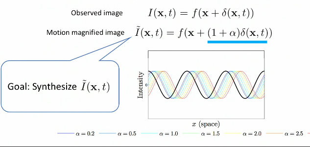

Traditional methods manipulate handcrafted features through classical signal processing techniques. Usually, these manipulations are divided into spatial **decomposition**, **temporal filtering**, and **reconstruction**.
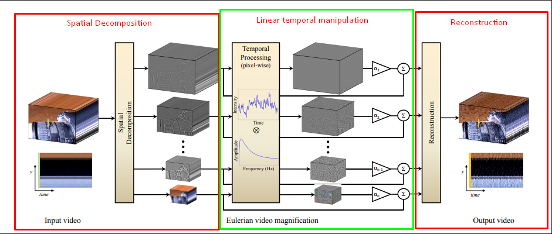
To manipulate the displacement Delta, we first need to extract the displacement through motion analysis. By keeping the Delta, we can magnify the video by scaling the motion and adding it back to the original sequence. Then, the reconstruction is done to obtain the magnified video. In prior art, extracting the motion information has been done through spatial decomposition and temporal filtering. Wu et al. used the first-order Taylor approximation, while Wadhwa et al. used Fourier theory and represented the displacement by phase.

However, these prior methods require careful hand design and often suffer from issues such as noise and artifacts near object boundaries.
!
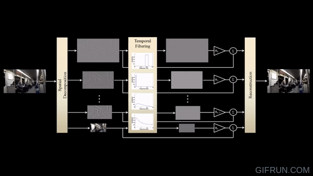

Also these techniques suffer from parallax and occlusion.
.gif>)

### Performance limitations of prior works
I suggest including an assessment of the performance of Eulerian Video Magnification and Phase Video Magnification techniques. This evaluation is important as we want to determine how well these methods work not only in controlled laboratory environments but also on everyday devices such as phones and regular computers. By considering performance metrics, we can understand how efficient and effective these techniques are in real-world usage scenarios. *[For further reading of the Performance Analysis Paper](https://ieeexplore.ieee.org/document/9214167)*
- **PSNR** (Peak Signal to Noise Ratio): PSNR is a measure of image quality after magnification. It calculates the difference between the original frame and the magnified frame of a video. Higher PSNR values indicate better image quality, while lower values indicate a decrease in quality due to magnification.
- **Execution Time**: Execution time measures how fast an algorithm processes the information. It is important to have a method that can magnify the video quickly. Recording the execution time helps identify the method that performs the magnification efficiently.
- **Color Magnification Intensity**: In video magnification, colors within a specific frequency range are amplified. Color magnification intensity is a qualitative parameter that observes the variation of color with changes in the pyramid level (a representation of different scales) in both Eulerian Video Magnification (EVM) and Phase Video Magnification (PVM) methods.
- **Motion Magnification Intensity**: Sometimes, when magnifying color, small motions can also get amplified, which may negatively impact the output and make it difficult to recognize. Motion magnification intensity is used as a qualitative parameter to assess the effectiveness of magnifying motion. It observes the change in intensity with changes in the pyramid level in both EVM and PVM methods.

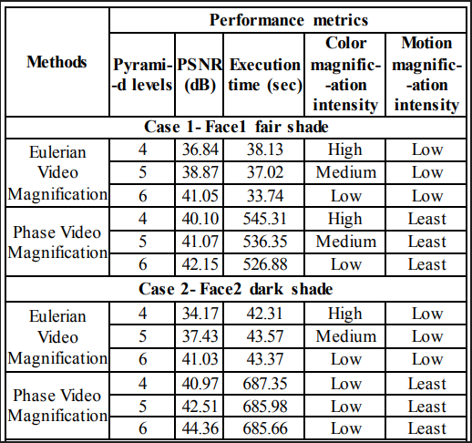
As you can see on the table, despite PVM having less noise, EVM outperforms PVM on execution time.
*[Android-based implementation of Eulerian Video Magnification for vital signs monitoring](https://www.semanticscholar.org/paper/Android-based-implementation-of-Eulerian-Video-for-Chambino/fd800357d760dbeb373ce1d1661cde42e562ec94)*

Let's continue to our paper. In order to solve this problems the researchers developed a better motion magnification method in a learning-based way. Solving these problems with a learning-based approach poses several challenges:
- **Lack of of real-world data** of motion-magnified pairs:
	They don't have real-world data for training because it doesn't exist in many cases and is very hard to obtain on a large scale. 
	
- **Subtle motion** is often indistinguishable from noise:
	Small motion can easily be corrupted by noise, so we need to be extra careful.
	
- Capturing all aspects of motion may require **temporal** history:
	Understanding the complex aspects of motion requires capturing long temporal history, which makes designing a handcrafted model very challenging and **computing across multiple frames is computationally expensive.**

In order to tackle these challenges, in this work, they need a better representation for motion magnification in a data-driven way. So they propose a **two-frame** based training, which is not only efficient to train but also generalizable to longer frame windows during testing. 
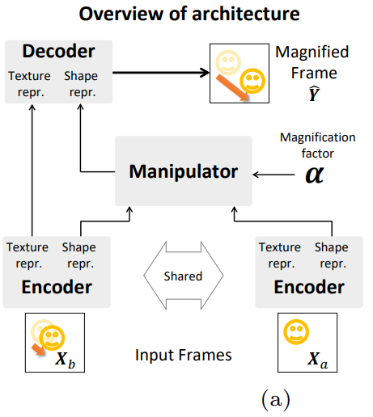
Lastly, due to the difficulty of obtaining real-world data, they generated synthetic data with a very simple simulation.
!.gif>)
Now, let's have a closer look at the network modeling. In order to train efficiently, they only use two frames as input and represent the motion by simple frame subtraction. This simplifies the difficulty of generating synthetic data.
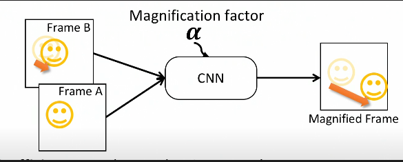
The network architecture consists of three main stages: the **encoder**, the **manipulator**, and the **decoder**. 

The encoder extracts the spatial representation of the input. The manipulator measures the temporal difference between frames and manipulates it by adding it back to the original representation.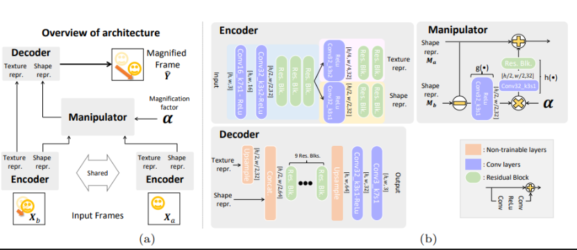
The main assumption behind this architecture is modeling velocity as the finite difference of positions. It's worth mentioning that all the arithmetic operations in the manipulator process each pixel independently.

Additionally, the **texture** information helps to prevent color magnification and preserve constant color. It also helps the representation to focus on structural information.
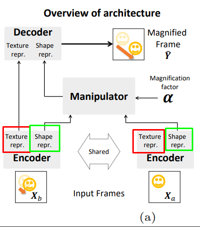
For training, they simply use the **L1 loss** over the synthesized magnified frame. However, this is not enough to induce meaningful representations of texture and shape.  So, they use a simple method to induce disentangled representations through color perturbation. They impose that ***if two frames have the same displacement, they should have the same shape representation***.

This also applies to texture representation, even ***if they have different displacements, as long as the colors are the same.***

The manipulator is designed to handle a wide variation of magnification factors without retraining. Another benefit is that due to the linearity of the manipulator, replacing the subtraction operation with a linear temporal filter at test time is compatible with our network. This allows us to select more general temporal operations.

## Synthetic Data Generation
Dataset consists of images with segmented foreground pasted directly onto backgrounds. We use segmentation from Pascal VOC and backgrounds from MS COCO. Each object has translational motion only, so no rotation or anything like that. 
They also randomized the directions and amplitude of motion for each object so that they can teach our network local motion.!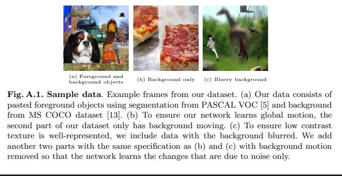

They use bicubic interpolation for sub-pixel motion and properly round the pixel values so that quantization doesn't give us small motion. They have only two frames for training, so digitizing the two input frames helps understanding why quantization can affect subtle motion.

Remember that videos are usually encoded with bit quantization. Consider this linear image with a sample point shown in red. If we move this image slightly to the right and sample the value, the value of our example won't quite fall on the quantization level. And when we convert these to integers, they get rounded down to the same level, resulting in no motion at all.

To remedy this problem, they quantize our values by randomly rounding them with a probability (Poisson) according to the residue value. 
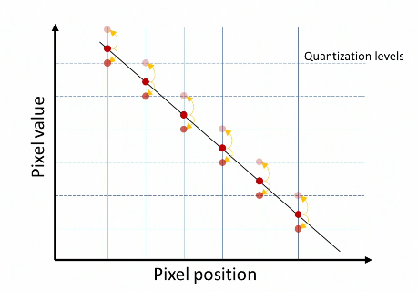
This helps to capture sub-pixel motion more accurately. 

In order to make training tractable, they also have to limit different parameters of the dataset. In particular, because they are interested in magnifying small motion, they limit the input motion to at most 10 pixels. Magnifying with a large magnification factor to produce large magnified motion is also difficult, so we limit the magnification factor to 100 times and the magnified motion to 30 pixels.

## Results
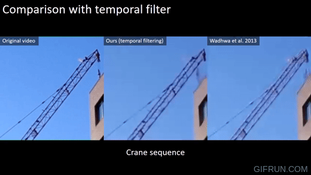
Proposed method preserves the edges better and has fewer ringing artifacts. Here's a frame from the crane sequence. Ringing artifacts are particularly pronounced for the face-based method when processing strong edges, as shown on the right. Our method, by contrast, is trained end-to-end and results in fewer ringing artifacts, as you can see in the middle.
-1.gif>)
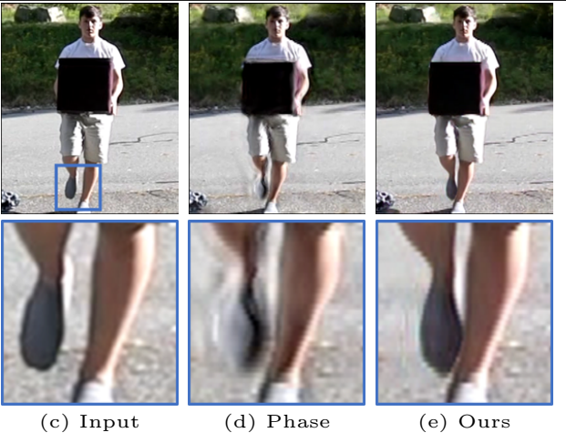
Another consequence of end-to-end training is that they have less blur. If you look at the boy's foot here, the result is much better preserved in the video in the middle, whereas the phase-based result is completely blurred out.
### Quantitative tests
Researchers also performed quantitative tests on the noise robustness. For this, we used synthetic data so that we have a ground truth to compare to. As the plot on the left shows, our network, shown in blue, is consistently performing better than the face-based method, shown in red. In particular, the face-based method quickly drops down to the baseline level as the noise level increases. We have more detailed results in our paper.
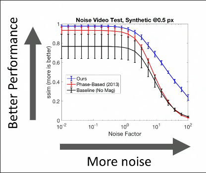

### Physical Accuracy of the method
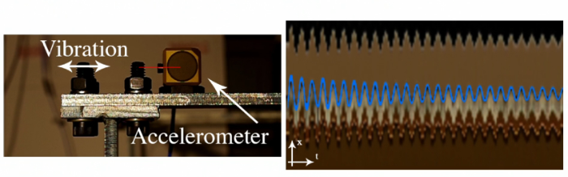
To test the physical accuracy of our method, we obtained the hammer sequence from the authors of Wadhwa. They provided accelerometer measurements, which we double integrated and used a high-pass filter to avoid drifts. This resulted in the blue line shown on the right. As you can see, this line matches our magnified motion quite well. And as shown on the x/t slice on the right, despite being trained on the two-frame input, proposed method seems to work with temporal filters too.

.gif>)
Here's a result of the guitar sequence processed using different temporal filters to select different strings. As you can see, each string was correctly selected by the temporal filter. This suggests that our the shape representation is linear enough with respect to displacement to work with temporal filters.
.gif>) .gif>) .gif>)

.gif>)
Despite these successes, they also observed that the method can sometimes only suppress noise and small motion that we may have hoped to magnify. This is an example of the eye sequence where the small motion is magnified properly on the right by the face-based method, but our magnification shows little or no motion, except in certain occasions where the motion is large. We believe that this is a problem with the temporal filter.

### Visualization of network
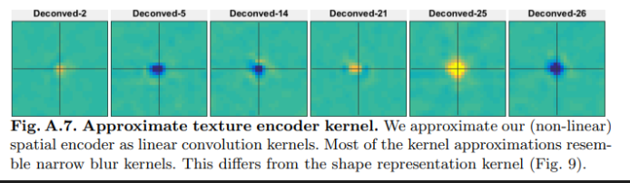
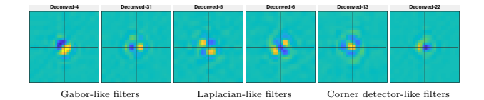
Lastly, in order to understand what the network has learned, they approximate their encoder response as a linear filter. The top row shows the response of the texture filters, which looks mostly like a blurring kernel. The shear filter at the bottom, on the other hand, shows a variety of derivative filters, including some higher-order ones. This suggests that the network learns reasonable filters consistent with understanding of how motion is detected.

# More in-depth analysis:
# 1. Introduction
## Background and motivations:
Video motion magnification techniques allow us to perceive subtle motions but this is a difficult task, because the motions are so small they can be indistinguishable from noise. Consequently, current video magnification techniques suffer from issues such as noisy outputs and excessive blurring, particularly when dealing with large magnification factors
## Objective of the research:
This article aims to address the limitations of existing video motion magnification techniques and proposes an innovative approach. The objective is to learn the decomposition filter directly from examples using deep convolutional neural networks (CNNs). By doing so, they aim to improve the overall performance, reduce noise, and minimize edge artifacts.
## Overview of the Proposed Method: 
To achieve the objective, they employ a synthetic dataset that realistically simulates small motion. This synthetic dataset is designed with careful considerations, including pixel value interpolation and explicit modeling of quantization. These measures enable the training of a network that generalizes well in real videos.

The proposed method, **inspired by the [work of Wadhwa et al](http://people.csail.mit.edu/nwadhwa/phase-video/)**, incorporates spatial decomposition filters, representation manipulator, and reconstruction filters. By utilizing a simplified training approach with a two-frame input and magnified difference as the target, the network achieves impressive noise reduction and fewer edge artifacts. The learned representations support linear operations and enable the selection of motion based on frequency bands of interest. This approach presents a significant advancement in the field of video motion magnification, providing enhanced performance and improved control over the amplification process.

# 2. Related work
### Lagrangian and Eulerian Approaches in Video Motion Magnification:
Video motion magnification techniques can be categorized into two main approaches: Lagrangian and Eulerian. The Lagrangian approach involves explicitly extracting the motion field, typically optical flow, and using it to directly move the pixels. On the other hand, Eulerian approaches decompose video frames into representations that facilitate motion manipulation without the need for explicit tracking. These techniques generally consist of three stages: frame decomposition, manipulation of the representation, and reconstruction of the manipulated representation into magnified frames. Wu et al. employ a spatial decomposition method based on the first-order Taylor expansion, while Wadhwa et al. utilize the complex steerable pyramid to extract a phase-based representation. Current Eulerian techniques excel at revealing subtle motions but are typically hand-designed. They often overlook challenges such as occlusion, leading to issues such as noise and excessive blurring. In contrast, our proposed technique belongs to the Eulerian approach, but with a decomposition that is directly learned from examples. As a result, our method exhibits fewer edge artifacts and better noise characteristics.
### Limitations of existing video motion magnification techniques:

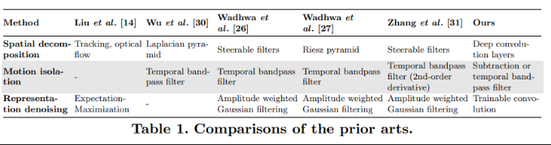
Current Eulerian techniques in video motion magnification, such as those by Wu et al. and Wadhwa et al., have some limitations. These techniques excel at revealing subtle motions but are often hand-designed and do not effectively address issues like occlusion. As a result, they are susceptible to noise and tend to introduce excessive blurring. In contrast, our proposed technique belongs to the Eulerian approach, but our decomposition is directly learned from examples. This learning-based approach results in fewer edge artifacts and improved noise characteristics.
Another limitation of previous motion magnification methods is their reliance on multi-frame [temporal filtering](https://en.wikibooks.org/wiki/Neuroimaging_Data_Processing/Processing/Steps/Temporal_Filtering#:~:text=Temporal%20filtering%20aims%20to%20remove,interest%20and%20which%20are%20noise.) to isolate motions of interest and prevent noise amplification. Wu et al. and Wadhwa et al. employ standard frequency bandpass filters for this purpose, achieving high-quality results. However, these methods suffer from degraded performance when dealing with large motions or drifts in the input video. In contrast, Elgharib et al. and Zhang et al.  address this limitation by incorporating techniques like affine transformation or second-order derivative temporal processing. Remarkably, our method achieves comparable quality even without relying on temporal filtering.

Additionally, it is worth noting that while some recent techniques excel in frame interpolation by explicitly shifting pixels using optical flow or pixel-shifting convolution kernels, they often require re-training when adjusting the magnification factor.

# 3. Methodology

They adopt the definition of motion magnification provided by Wu et al( [Eulerian Video Magnification](https://youtu.be/ONZcjs1Pjmk) ) . and Wadhwa et al([Phase-Based Video Motion Processing](https://youtu.be/W7ZQ-FG7Nvw)). In Wu et al.'s work, they analyze the relationship between temporal processing and motion magnification, specifically focusing on the case of a 1D signal undergoing translational motion. This analysis can be extended to locally-translational motion in 2D.
They start by considering an image intensity function, denoted as I(x, t), where x represents the position and t represents the time. In the case of translational motion, they introduce a displacement function δ(t) to describe the observed intensities. With this displacement function, the image intensities can be expressed as I(x, t) = f(x + δ(t)), where f(x) represents the intensity at position x without motion, and I(x, 0) represents the initial image intensities.
The objective of motion magnification in this context is to synthesize the signal, which essentially involves amplifying the motion within the image. The amplification process is achieved by modifying the displacement function δ(t) in a way that magnifies the underlying motion. The synthesized signal can be represented as:

$I(x, t) = f(x + (1 + α)δ(t))$,

where α is the magnification factor.
However, in practice, we may not want to magnify all motion signals within the image. Instead, we are interested in selectively magnifying specific motion components that are of interest to us. To achieve this, a selector function $T(·)$ is introduced, which acts as a filter or mask to determine the motion signals to be magnified. The selected motion signal is denoted as $δ˜(x, t) = T(δ(x, t))$, where $T(·)$ typically represents a temporal bandpass filter.

In previous motion magnification techniques, the filters used to extract and manipulate the motion signals were hand-crafted, requiring domain expertise and manual design. In contrast, purposed method is to learn a set of filters automatically that can effectively extract and manipulate the representations of the motion signal $δ(x, t)$ to generate magnified frames.

*Here in this figure you can see some of the **hand-made** filters based on the specific situation. (Wu et al)*

# Deep Convolutional Neural Network Architecture

Encoder and decoder are fully convolutional, which means they are designed to work with inputs of any resolution. This flexibility allows the network to handle different image sizes effectively. Residual blocks are used in both the encoder and decoder to generate high-quality output. Residual blocks are a type of neural network layer that help capture and propagate important features through the network, leading to improved performance and output quality.
To reduce the memory usage of the network and increase the size of the receptive field (the effective area that each neuron can "see" in the input), they employ down-sampling at the beginning of the encoder and up-sampling at the end of the decoder. Down-sampling is achieved through strided convolution, which involves using larger strides during the convolution operation to reduce the spatial dimensions of the activations.
On the other hand, we use nearest-neighbor up-sampling followed by a convolutional layer to avoid checkerboard artifacts, which can occur when using standard up-sampling techniques [20]. Nearest-neighbor up-sampling involves duplicating each pixel in the input to increase the resolution. By combining this with a convolutional layer, which applies learnable filters to the up-sampled features, we ensure smoother and more visually appealing results.
Through experimental evaluation, we have determined that employing three 3 × 3 residual blocks in the encoder and nine in the decoder generally produces favorable results in terms of network performance and output quality. These choices strike a balance between model complexity and effectiveness, allowing the network to capture and manipulate motion information effectively while maintaining reasonable computational efficiency.

In Equation (1), it is assumed that there is no change in intensity (represented by f(·)) between frames. However, in reality, this assumption does not hold true. As a result, the network ends up magnifying intensity changes along with motion. To address this issue, we introduce an additional output from the encoder that represents intensity information, referred to as the "texture representation" [9]. This texture representation is similar to the amplitude of the [steerable pyramid decomposition](https://en.wikipedia.org/wiki/Pyramid_(image_processing)), a technique used for analyzing image features.
The inclusion of the texture representation helps mitigate undesired intensity magnification and reduces noise in the final output. To further enhance the noise reduction, we downsample the texture representation by a factor of 2. This downsampling operation helps to alleviate noise artifacts. In the context of the network architecture, the outputs of the encoder corresponding to the texture and shape representations are denoted as $V = G_{e,texture}(X)$ and $M = G_{e,shape}(X)$, respectively.
During the training process, we incorporate a regularization loss to encourage a clear separation between these two representations. This regularization loss penalizes any overlap or mixing of texture and shape information, thereby ensuring that the network learns to generate distinct representations for each. The details of this regularization loss will be discussed in more depth later in the article.
The objective of our approach is to learn a shape representation, denoted as M, that exhibits a linear relationship with respect to the motion signal $δ(x, t)$. To achieve this, our manipulator module operates by taking the difference between the shape representations of two given frames, denoted as Ma and Mb. We then multiply this difference by a magnification factor, denoted as α, and add it back to the original shape representation. Mathematically, this can be expressed as:
$G_m(M_a,M_b, α) = Ma + α ( M_b − M_a)$
In practice, we have found that introducing some non-linearity into the manipulator module can improve the quality of the magnified output. Specifically, we modify the manipulator equation as
$G_m(M_a,M_b, α) = Ma + h (α · g(M_b − M_a))$
where $g(·)$ represents a 3 × 3 convolution operation followed by a Rectified Linear Unit (ReLU) activation function. The function h(·) is represented by a 3×3 convolution followed by a 3×3 residual block.

### Loss function
During the training process, the entire network is trained in an end-to-end manner. To measure the dissimilarity between the network's output Yˆ and the ground-truth magnified frame Y, we use the l1-loss (mean absolute error). We found that using more advanced loss functions, such as perceptual loss or adversarial losses, did not result in noticeable improvements in the output quality.

To encourage the separation of the texture and shape representations within the network, we introduce perturbations in the intensity of certain frames. The objective is to ensure that the texture representations of the perturbed frames, denoted as $V_b'$ and $V_Y'$, remain unchanged, while their shape representations, denoted as M0b and Mb, also remain unchanged. Specifically, we create perturbed frames, $X_b'$ and $Y'$, by applying color perturbations indicated by the prime symbol. We then compute losses between these perturbed frames and the un-perturbed frames, $V_a$ and $V_b$, as well as losses between the shape representations of the perturbed frames, $M_b'$ and $M_b$.

For all these regularizations, we use the [L1-loss](https://pytorch.org/docs/stable/generated/torch.nn.L1Loss.html) as the measure of dissimilarity. Therefore, during training, the entire network G is optimized by minimizing the final loss function, which consists of the l1-loss between Y and Yˆ, along with the sum of l1-losses between $V_a$ and $V_b$, $V_b'$ and $V_Y'$, and $M_b$ and $M_b'$. The regularization weight λ, set to 0.1, determines the importance of these losses in the overall optimization process.

### Training
We use ADAM with β1 = 0.9 and β2 = 0.999 to minimize the loss with the batch size 4. We set the learning rate to 10−4 with no weight decay. In order to improve robustness to noise, we add Poisson noise with random strengths whose standard deviation is up to 3 on a 0−255 scale for a mid-gray pixel.

The addition of Poisson noise during training is done to enhance the robustness of the network to noise. Poisson noise is a type of statistical noise that is often encountered in real-world images. By introducing Poisson noise with random strengths, the network learns to handle and account for such noise in the input data. This helps improve the network's ability to generalize and produce accurate results even when faced with noisy input images.

### Applying 2-frames setting to videos
In the context of applying our network to videos, we operate under the assumption that the network was trained without considering any temporal aspects. Therefore, our network can be applied as long as the input consists of two frames.

We offer two different modes for applying the network, each using different frames as a reference. The Static mode utilizes the first frame as a fixed anchor, while the Dynamic mode considers the previous frames as a reference. In the Dynamic mode, the input consists of a pair of frames $(X_{t-1}, X_t)$, where $X_t−1$ represents the previous frame and $X_t$ represents the current frame.

In the Static mode, the magnification process aligns with the traditional definition of motion magnification described in Equation (1). It focuses on magnifying the overall motion against a fixed reference frame. On the other hand, the Dynamic mode emphasizes magnifying the difference (velocity) between consecutive frames, highlighting the relative motion between frames.

It's important to note that the magnification factor in each mode carries a different interpretation. In the Static mode, it represents the amplification of motion against the fixed reference frame. In contrast, in the Dynamic mode, it represents the magnification of the velocity or speed of motion between consecutive frames.

However, since our network lacks a temporal filter component, undesired motion and noise can become problematic as the magnification factor increases. This poses a challenge in achieving high-quality results, as the absence of a temporal filter may lead to the amplification of unwanted artifacts and noise along with the desired motion.

### Temporal operation
In spite of being trained on a two-frame input, our network demonstrates linearity between the shape representation and the displacement, making it compatible with linear temporal filters. Given the shape representation $M(t)$ of a video, which is obtained by extracting frames individually, we replace the traditional difference operation with a pixel-wise temporal filter $T(·)$ applied across the temporal axis within the manipulator $Gm(·)$.

In other words, we introduce a modified version of the manipulator called $G_{m,temporal}(·)$, which incorporates temporal filtering. It operates on the shape representation $M(t)$ and applies the temporal filter to each pixel independently. The mathematical expression for $G_{m,temporal}(·)$ is given by:

$G_{m,temporal}(M(t), α) = M(t) + αT(M(t))$ (Equation 4)

The decoder takes the improved shape representation and texture representation as input. It uses these representations to generate motion magnified frames by applying transformations and combining the enhanced motion information with the texture details. Essentially, the decoder reconstructs the final output frames by leveraging the enhanced shape representation and the texture information.

### Synthetic Training Dataset

Obtaining real motion magnified video pairs is challenging. Therefore, we utilize a synthetic dataset to generate a large quantity of data. Careful considerations are made to simulate small motions accurately, as any small error can result in significant discrepancies. Our dataset is designed with several key factors in mind.

Firstly, we combine real image datasets to incorporate realistic textures. We use 200,000 background images from the MS COCO dataset and 7,000 segmented objects from the PASCAL VOC dataset for the foreground. To simulate the occlusion effect, we directly paste the foreground objects onto the background. Each training sample consists of 7 to 15 randomly scaled foreground objects, ensuring that the network learns local motions by randomizing the amount and direction of motions for both the background and objects.

To improve generalization, we introduce examples with low contrast textures and global motions. We include cases where the background is blurred and scenes with only a moving background to mimic a large object. These examples enhance the network's performance on large and low contrast objects found in real videos.

Additionally, we address the challenge of small motion being indistinguishable from noise. To help the network learn changes that are due to noise, we incorporate static scenes in the dataset. This includes subsets with completely static scenes and scenes where the background remains static while the foreground moves.

Our dataset consists of five parts, each containing 20,000 samples of 384x384 images. The examples of our dataset can be found in the supplementary material.

Furthermore, we carefully parameterize each training example to ensure the learnability of the task. We limit the magnification factor (α) up to 100 and sample the input motion within a range of up to 10 pixels. This ensures that the resulting magnified motion does not exceed 30 pixels, balancing the difficulty of magnifying small motions at high magnifications.

To generate subpixel motion, the researchers consider the [demosaicking algorithm](https://rawpedia.rawtherapee.com/Demosaicing) and camera sensor pattern. Even though the raw images were already demosaicked, they downsampled them to prevent artifacts. Before applying translation or resizing, the images were reconstructed in the continuous domain using bicubic interpolation. To minimize errors caused by small translations, the dataset was initially generated at a higher resolution and then downsampled to the desired size. Additionally, a Gaussian filter was applied during downsampling to reduce aliasing.

[Subpixel motion](https://dsp.stackexchange.com/questions/34103/subpixel-what-is-it) often manifests as subtle intensity changes that are below the precision level of 8-bit quantization. These changes can be rounded away, particularly in regions with low contrast. To overcome this issue, the researchers introduced uniform quantization noise before quantizing the image. This noise introduced randomness to the quantization process, allowing each pixel to have a chance of rounding up proportionally to its rounding residual. As a result, the representation of subpixel motion was accurately preserved in the quantized image.

# 4. Results and Evaluations

### Qualitative comparison
In this comparison, the phase-based method exhibits noticeable ringing artifacts, while our method demonstrates nearly artifact-free results. This disparity arises from the fact that our representation is trained end-to-end from example motion, allowing it to effectively preserve edges and minimize artifacts.

### The effect of temporal filters

The effect of temporal filters on our method's performance has been examined. Although our method was not trained using temporal filters, experiments demonstrate that the filters can be applied effectively with our representation. For instance, when using temporal filters to select motion on the guitar sequence, the filters correctly identify the vibrating strings, indicating compatibility with our representation.

Furthermore, temporal processing can enhance the quality of our results by preventing the amplification of unwanted motion. This is illustrated by a comparison on the drum sequence. When magnifying the sequence using two frames (static mode) with a temporal filter, blurring artifacts are reduced. However, even without the use of a temporal filter, our method excels at preserving edges and avoids ringing artifacts. In contrast, the phase-based method exhibits significant ringing artifacts, even with the application of a temporal filter.

Therefore, while temporal filters can improve our method's performance by reducing certain artifacts caused by undesired motion, our approach remains robust in edge preservation and artifact reduction without relying on temporal filters. These findings highlight the flexibility and effectiveness of our method in handling motion magnification tasks.

### Two-frames setting results

The two-frames setting is found to be the most suitable for applying our network, aligning well with its training. When magnifying consecutive frames using our network in dynamic mode, we compared the results with the approach by Zhang et al. Fig. 6 illustrates the outcome on the gun sequence, where our network was utilized in dynamic mode without a temporal filter. As seen before, our result exhibits minimal artifacts, while Zhang et al.'s approach suffers from ringing artifacts and excessive blurring, likely due to its reliance on the complex steerable pyramid. Notably, the interpretation of the magnification factor may differ between our method and Zhang et al., but for this particular sequence, using the same magnification factor of 8× yielded a magnified motion of roughly the same size.

Furthermore, our method's performance excels due to its adaptability in the dynamic mode, magnifying consecutive frames. The network's training specifically aligns with this setting, enabling it to produce artifact-free results. In contrast, Zhang et al.'s approach, although employing a similar magnification factor, fails to deliver comparable quality, suffering from ringing artifacts and excessive blurring. This discrepancy may stem from the differences in underlying methodologies, particularly their reliance on the complex steerable pyramid.

These findings underscore the effectiveness of the two-frames setting for our network, demonstrating its superiority over Zhang et al.'s approach in terms of artifact reduction and the quality of magnified results. The alignment of our method's training with this setting allows it to leverage consecutive frame information effectively, yielding nearly artifact-free magnifications.

### Quantitative analysis

Synthetic examples were generated to evaluate the representation's performance, particularly in visualizing sub-pixel motion and resilience to noise. The tests were conducted without temporal processing, as the aim was to focus on comparing the representation.

For the subpixel motion test, synthetic data with foreground input motion ranging from 0.01 to 1 pixel was generated, and the magnification factor was adjusted to produce 10 pixels of magnified motion. No noise was added, and the background was moved in a different direction to ensure accurate evaluation.

In the noise test, fixed amounts of input motion and magnification factor were used, and noise was added to the input frames. The performance of both methods was compared without moving the background. Photon noise was simulated by creating a noise image with variance matching each pixel's value in the original image. A multiplicative noise factor controlled the strength of the added noise.

Throughout the tests, the described method consistently outperformed the phase-based method. In the sub-pixel motion test, the performance of the described method remained high even at 0.01 pixels of input motion, surpassing one standard deviation of the phase-based method's performance as the motion increased. Despite being trained only up to 100× magnification, the network of the described method performed well at the smallest input motion (0.01), suggesting that the limitations are more influenced by the required output motion rather than the magnification factors.

In the noisy conditions, the described method consistently outperformed the phase-based method. As the noise factor increased above 1.0, the performance of the phase-based method quickly dropped to the baseline level, while the described method maintained higher performance. The performance degradation of the described method was more pronounced with smaller input motion, as distinguishing actual motion from noise becomes more challenging.

Overall, the quantitative analysis confirmed that the described method outperforms the phase-based method in terms of sub-pixel motion visualization and resilience to noise, highlighting the effectiveness and robustness of the representation.

